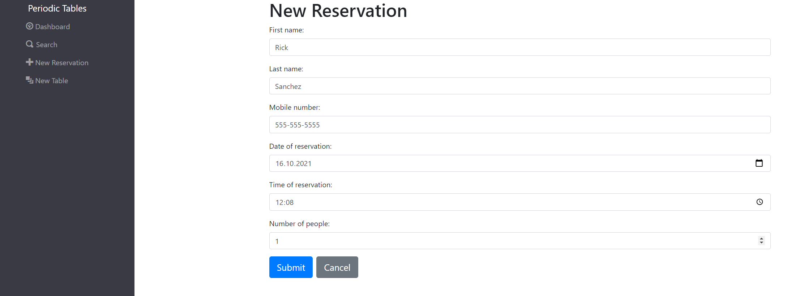
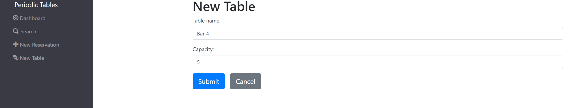
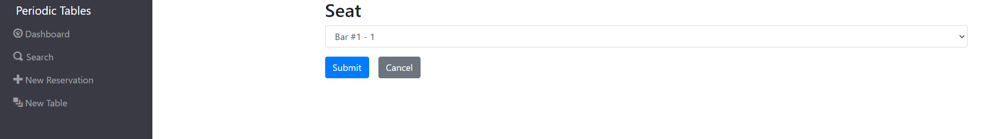
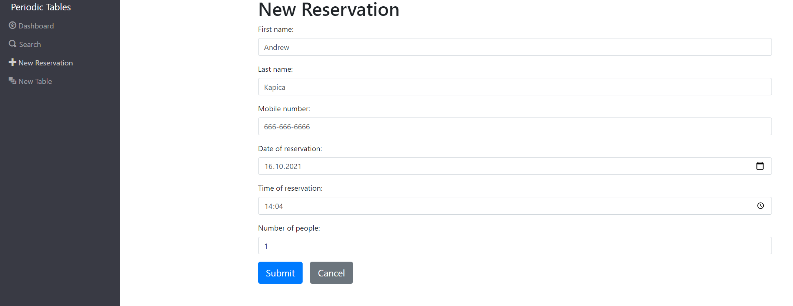
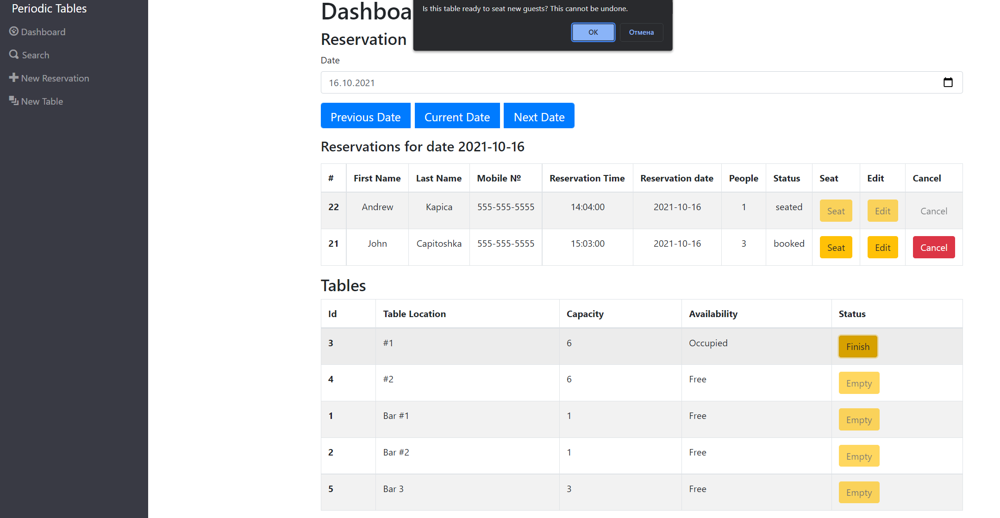
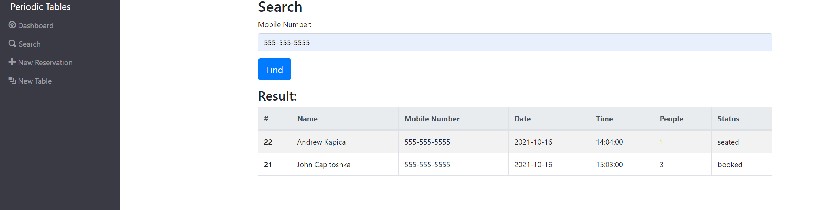

# Capstone: Restaurant Reservation System
## Live version
https://reservations-sys-frontend.herokuapp.com/dashboard

# About this project

This is a final capstone full-stack project from Thinkful bootcamp that was built to demonstrate my mastery of React, Node.js, and PostgreSQL. For this capstone, both the client and the API were built to support the app.
This app could be used to create reservations for a restaurant and store it onto a database where it can later be modified and changed, as well as other helpful features restaurants would use.

Built using HTML, CSS BOOTSTRAP, JAVASCRIPT, REACT, EXPRESS, NODE, POSTGRESQL, KNEX.

### Legend:
> You have been hired as a full stack developer at _Periodic Tables_, a startup that is creating a reservation system for fine dining restaurants.
> The software is used only by restaurant personnel when a customer calls to request a reservation.
> At this point, the customers will not access the system online.

## Installation instructions

To use and test this application on your local machine do the following:

1. Fork and Clone this repository
2. Run ```npm install```
3. Run ```npm start```

## Existing files

The table below describes the folders in this repository:

| Folder/file path | Description                                                      |
| ---------------- | ---------------------------------------------------------------- |
| `./back-end`     | The backend project, which runs on `localhost:5000` by default.  |
| `./front-end`    | The frontend project, which runs on `localhost:3000` by default. |

This starter code closely follows the best practices and patterns established in the Robust Server Structure module.

### Backend Existing files

The table below describes the existing files in the `./back-end` folder:

| Folder/file path                                   	   | Description                                                                                            |
| ---------------------------------------------------------| --------------------------------------------------------------------------------------------------     |
| `./back-end/knexfile.js`                           	   | The Knex configuration file. 							              	    |
| `./back-end/src/app.js`             		    	   | Defines the Express application and connects routers.    					      	    |
|  `./back-end/src/db/connection.js`                 	   | The Knex connection file.                							            |
| `./back-end/src/db/migrations`                     	   | The Knex migrations folder. 									    |
| `./back-end/src/db/seeds/`           		           | The Knex seeds folder.                                                                                 |
| `./back-end/src/errors/errorHandler.js`                  | Defined an Express API error handler.                                                        	    |
| `./back-end/src/errors/notFound.js`                      | Defined an Express API "not found" handler.                         				    |
| `./back-end/src/reservations/reservations.controller.js` | A controller for the reservations resource.                                                            |
| `./back-end/src/reservations/reservations.router.js`     | A router for the reservations resource.                                                                |
| `./back-end/src/server.js`                         	   | Defines the node server.                                                                  		    |
| `./back-end/test`               		     	   | A folder that contains all of the integration tests.                             			    |
| `./back-end/vercel.json`                           	   | A vercel deployment configuration file.                                                                |
| `./back-end/src/reservations`                      	   | A vercel deployment configuration file.                                                   		    |
| `./back-end/src/server.js`                         	   | A vercel deployment configuration file.                                                                |
| `./back-end/src/server.js`                         	   | A vercel deployment configuration file.                						    |


### Frontend Existing files

The table below describes the existing files in the `./front-end` folder:

| Folder/file path                                   | Description                                                                                            |
| -------------------------------------------------- | ------------------------------------------------------------------------------------------------------ |
| `./front-end/e2e`                                  | Contains all of the end-to-end tests. 							              |
| `./front-end/jest-puppeteer.config.js`             | A configuration file used by the end-to-end tests. 						      |
| `./front-end/src/App.js`                           | Defines the root application component. 						                      |
| `./front-end/src/App.test.js`                      | Contains the tests for the root application component. 						      |
| `./front-end/src/dashboard/Dashboard.js`           | Defines the Dashboard page.                                                                            |
| `./front-end/src/index.js`                         | The main entry point for the React application.                                                        |
| `./front-end/src/layout/ErrorAlert.js`             | Defines an error alert component that display only when an error is specified.                         |
| `./front-end/src/layout/Layout.css`                | The css for the Layout component.                                                                      |
| `./front-end/src/layout/Layout.js`                 | Defines the main layout of the application.                                                            |
| `./front-end/src/layout/Menu.js`                   | Defines the menu for the application.                                                                  |
| `./front-end/src/layout/NotFound.js`               | Defines the "Not found" component that is displayed when no route matches.                             |
| `./front-end/src/layout/Routes.js`                 | Defines all the routes for the application.                                                            |
| `./front-end/src/utils/api.js`                     | Defines the functions used to access the backend API                                                   |
| `./front-end/src/utils/date-time.js`               | Defines functions to format date and time strings.                                                     |
| `./front-end/src/utils/format-reservation-date.js` | Defines a function to format the date on a single reservation or an array of reservations.             |
| `./front-end/src/utils/format-reservation-time.js` | Defines a function to format the time on a single reservation or an array of reservations.             |
| `./front-end/src/utils/useQuery.js`                | Defines a custom hook to parse the query parameters from the URL.                                      |


## API (./front-end/utils/api.js)

### listReservations
Sends a GET request to the reservations table and returns a list of reservations from a given date

### listTables
Sends a GET request to the tables, returns a list of tables

### createReservation
Sends a POST request to reservations table and creates a new reservation

### createTable
Sends a POST request to the tables and creates a new table

### updateSeat
Sends a PUT request to tables and updates seat availability

### finishTable
Sends a DELETE request to the tables and changing the status to "finished"

### updateReservation
Sends a PUT request to the reservations table and updates the reservation

### findReservation
Searches for a reservation by reservation Id

### editReservation
Sends a PUT request to the reservations table and updates the reservation with the new data

## Instructions

#### Screenshots

To help you better understand how this application works, screenshots were taken at various points in the developing process.

### 1 Add new reservation
To create a new reservation, select the "New Reservation" button on the navigation panel.
Then fill in data to each field. 
People field cannot be negative or zero.
Date must be future and not Tuesday. 
Time must be after 10:30AM and before 10:30PM.




### 2 Add new table
To create a new table, select the "New Table" button on the navigation panel.
Then fill in data to each field.



### 3 Seat a reservation
From Dashboard or Search pages, click the "Seat" button to edit corresponding reservation.
Select a table from the dropdown menu and click the "Submit" button.



### 4 Edit a reservation
From Dashboard or Search pages, click the "Edit" button to edit the corresponding reservation.
Then edit desired fields and click the "Submit" button.
People field cennot be negative or zero.
Date must be future and not Tuesday. 
Time must be after 10:30AM and before 10:30PM.



### 5 Finish a table
From Dashboard, click the "Finish" button to edit corresponding table.
A notification window will pop up.



### 6 Search for a reservation by mobile number
You can search reservations by mobile number. To do that, click the "Search" button on the navigation panel.
Then enter mobile number into an input field.




